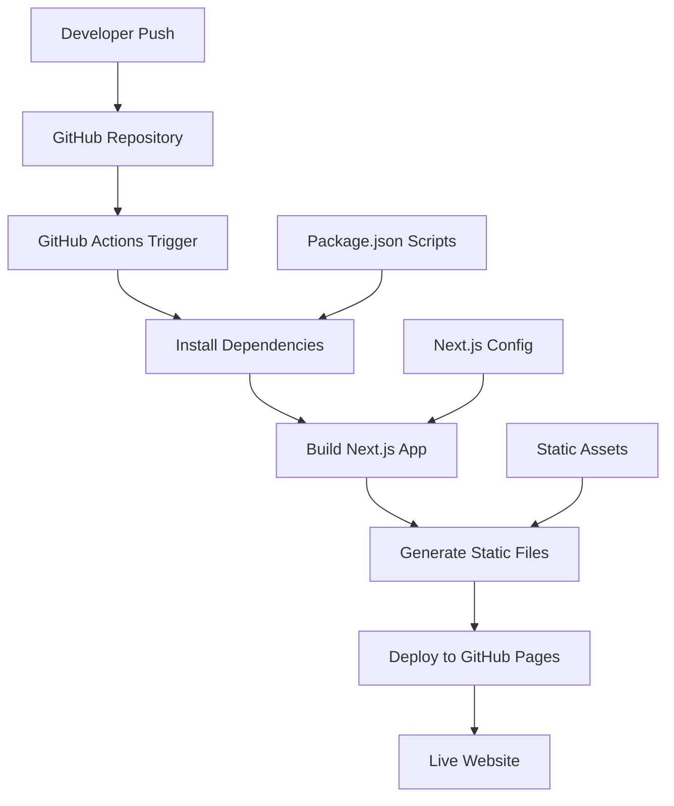

# Design Document

## Overview

The portfolio deployment design focuses on configuring a Next.js React application for static site generation and automated deployment to GitHub Pages. The solution leverages GitHub Actions for CI/CD, Next.js static export capabilities, and proper asset handling for a seamless deployment experience.

## Architecture

### Deployment Pipeline Architecture



### File Structure for Deployment

```
portfolio/
├── .github/
│   └── workflows/
│       └── deploy.yml          # GitHub Actions workflow
├── public/                     # Static assets
│   ├── Sai_Ruthvik MLE.pdf    # Resume file
│   └── images/                 # Image assets
├── src/                        # Source code
├── next.config.js              # Next.js configuration
├── package.json                # Dependencies and scripts
└── out/                        # Generated static files (after build)
```

## Components and Interfaces

### 1. Build Configuration Component

**Next.js Configuration (`next.config.js`)**
- Static export configuration
- Image optimization settings
- Asset prefix handling for GitHub Pages
- Output directory specification

**Package.json Scripts**
- Build script for static generation
- Export script for GitHub Pages
- Development and production scripts

### 2. GitHub Actions Workflow Component

**Workflow Configuration (`.github/workflows/deploy.yml`)**
- Node.js environment setup
- Dependency installation
- Build process execution
- Static file deployment
- Error handling and notifications

**Deployment Steps**
1. Checkout repository code
2. Setup Node.js environment
3. Install project dependencies
4. Build and export static files
5. Deploy to GitHub Pages branch

### 3. Asset Management Component

**Static Asset Handling**
- Public directory file serving
- PDF resume file accessibility
- Image optimization and serving
- Font and CSS asset management

**Routing Configuration**
- Client-side routing setup
- 404 page handling
- Base path configuration for GitHub Pages

## Data Models

### Build Configuration Model

```typescript
interface BuildConfig {
  output: 'export';
  images: {
    unoptimized: boolean;
  };
  basePath?: string;
  assetPrefix?: string;
  trailingSlash?: boolean;
}
```

### Deployment Workflow Model

```yaml
name: Deploy to GitHub Pages
on:
  push:
    branches: [main]
jobs:
  build-and-deploy:
    runs-on: ubuntu-latest
    steps:
      - name: Checkout
      - name: Setup Node.js
      - name: Install dependencies
      - name: Build
      - name: Deploy
```

### Asset Configuration Model

```typescript
interface AssetConfig {
  publicPath: string;
  staticFiles: string[];
  optimizedImages: boolean;
  compressionEnabled: boolean;
}
```

## Error Handling

### Build Error Handling

**Build Failure Scenarios**
- TypeScript compilation errors
- Missing dependencies
- Asset optimization failures
- Configuration errors

**Error Resolution Strategy**
- Clear error messaging in GitHub Actions logs
- Automatic retry mechanisms for transient failures
- Fallback configurations for asset handling
- Build status notifications

### Deployment Error Handling

**Deployment Failure Scenarios**
- GitHub Pages service unavailability
- Permission issues
- Large file size limitations
- Branch protection conflicts

**Recovery Mechanisms**
- Automatic rollback to previous successful deployment
- Manual deployment triggers
- Alternative deployment branch strategies
- Error notification systems

### Runtime Error Handling

**Client-Side Error Scenarios**
- Missing static assets
- Routing failures
- PDF file access issues
- Mobile compatibility problems

**Fallback Strategies**
- Default error pages
- Asset loading fallbacks
- Progressive enhancement approach
- Graceful degradation for older browsers

## Testing Strategy

### Pre-Deployment Testing

**Local Build Testing**
- Static export generation verification
- Asset path validation
- Component rendering tests
- Mobile responsiveness checks

**Staging Environment Testing**
- GitHub Pages preview deployment
- Cross-browser compatibility testing
- Performance optimization validation
- SEO metadata verification

### Post-Deployment Testing

**Production Validation**
- Live site functionality testing
- Resume download verification
- Contact form testing (if applicable)
- Analytics integration validation

**Monitoring and Maintenance**
- Uptime monitoring setup
- Performance metrics tracking
- Error logging and reporting
- Regular security updates

### Automated Testing Integration

**GitHub Actions Testing**
- Unit test execution before deployment
- Build verification tests
- Link checking and validation
- Accessibility testing automation

**Quality Assurance Checks**
- Code quality linting
- TypeScript type checking
- CSS validation
- Image optimization verification

## Performance Optimization

### Build Optimization

**Static Generation Benefits**
- Pre-rendered HTML for faster loading
- Optimized asset bundling
- Tree shaking for smaller bundle sizes
- Automatic code splitting

**Asset Optimization**
- Image compression and optimization
- CSS and JavaScript minification
- Font loading optimization
- Critical CSS inlining

### Deployment Optimization

**GitHub Pages Configuration**
- CDN utilization for global distribution
- Caching strategy implementation
- Compression enabling
- HTTP/2 support utilization

**Loading Performance**
- Lazy loading for images
- Progressive web app features
- Service worker implementation
- Resource preloading strategies

## Security Considerations

### GitHub Pages Security

**HTTPS Configuration**
- Automatic HTTPS enforcement
- SSL certificate management
- Secure asset delivery
- Mixed content prevention

**Access Control**
- Repository visibility settings
- Branch protection rules
- Deployment key management
- Secrets handling in GitHub Actions

### Content Security

**Static Site Security**
- XSS prevention measures
- Content Security Policy headers
- Secure external link handling
- Input validation for contact forms

**Asset Security**
- Secure file serving
- PDF access control considerations
- Image hotlinking prevention
- Resource integrity verification